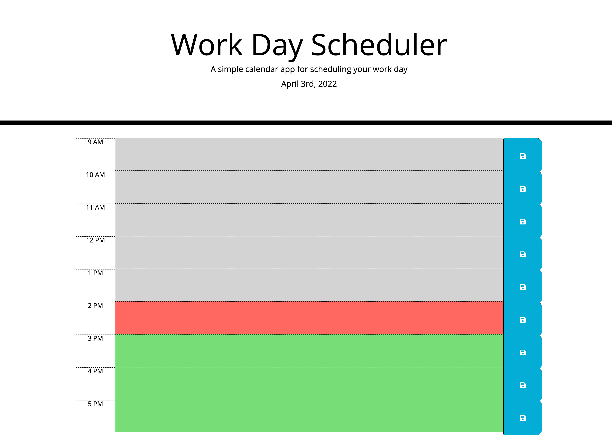

# work-day-scheduler

## Built With
* HTML (some provided)
* CSS (provided)
* Javascript 
* JQuery 
* Moment.JS
* Bootstrap

## Website
https://aubree-alexander.github.io/work-day-scheduler/

## Description/Purpose
* Challenge for UW Extensions Coding Bootcamp. The CSS and some HTML were provided, and I contributed the Javascript and JQuery, as well as some Bootstrap and Moment.JS.
* Functionality: User can click into time slots and enter in task text, click 'save', and once the page is refreshed their task items will still be present. The calendar indicates the time of the day that has passed (colored grey), vs. the present time (colored red), vs. future time (colored green) to help them prioritize their tasks.
 
## Contribution
Aubree Alexander

## Screenshot
